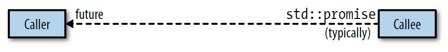
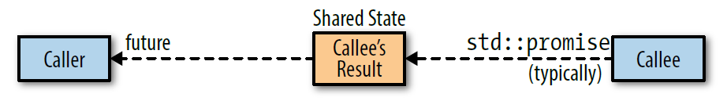

# 항목 38: 스레드 핸들 소멸자의 다양한 행동 방식을 주의하라

## 사전지식

### POSIX 스레드 모델

- 스레드는 종료된 이후에도 다른 스레드에서 그 결과를 가져다 처리할 수 있게 하기 위해 스레드 자원을 유지시킨다.
- 스레드는 **기본적으로** 종료되면 해당 스레드 자원은 다른 스레드에서 **join** 해주지 않는 이상 해제되지 않는다(좀비 스레드).
- 하지만 해당 스레드를 생성하고 **detach**를 시켜주면 해당 스레드가 종료된 뒤 자동으로 스레드 자원이 해제가 된다. (해당 스레드의 리턴값이 필요 없는 경우)

---

## 개요

### `std::thread`, `std::future` 비교

#### 공통점

- joinable한 `std::thread`는 시스템의 실행 스레드와 대응된다.
- non-deffered task(item36 참고)가 리턴하는 `std::future` 객체 또한 시스템 스레드에 대하여 비슷한 관계이다.
- 결국 `std::thread`와 `std::future` 둘다 시스템 스레드에 대한 handle이라고 할 수 있다.

#### 차이점

- joinable한 `std::thread`의 소멸은 프로그램을 멈추게 한다. (암묵적인 **join**과 암묵적인 **detach**를 피하기 위해)
- 반면에 `std::future`의 소멸자는 암묵적인 join을 할 수도 있고 암묵적인 detach를 할 수도 있고, 어느것도 하지 않을수도 있다.

### `std::future`, `std::promise` 사용 예시

```C++
std::promise<int> promise;
std::future<int> fut = promise.get_future();

std::thread t([](std::promise<int> promise) {
    std::this_thread::sleep_for(std::chrono::seconds(3));
    promise.set_value(412);
}, std::move(promise));
t.detach();

std::cout << fut.get() << std::endl;
```

---

## Thread caller callee model

- Caller가 `std::future`를 통해 스레드의 계산 결과를 받고, callee가 `std::promise`를 통해 계산 결과를 커뮤니케이션 채널에 넘기는 상황을 생각해보자.

### 단순한 모델



- callee의 계산 결과는 어디에 저장되어야 할까?
    + caller가 `std::future`를 통해 계산 결과를 요청하기 전에 callee가 종료될 수 있으니 `std::promise`에는 저장할 수 없다.
    + `std::shared_future`를 쓰는 상황을 가정해보자. 스레드의 계산 결과가 move-only 타입일 수 있고, `std::shared_future`의 여러 객체들 중 어디에 스레드 계산 결과를 저장할지도 정할 수 없으니 `std::future`에도 저장할 수 없다.
- 즉, caller와 callee의 어느 객체에도 스레드 계산결과를 저장할 수 없다는 결론이 나온다.

### 실제 모델



- 스레드의 계산 결과는 caller, callee 중 어느쪽에도 저장되지 않고 **shared state**라는 heap 기반 객체 내에 저장된다.

---

## `std::future`의 소멸자

### 행동방식

- `std::future`의 소멸자의 행동은 shared state에 의해 결정된다.
    + `std::async`에 의해 생성된 non-deffered task에 대한 shared state를 가리키는 마지막 `std::future` 객체의 소멸자는 해당 task가 완료될 때까지 block 된다. (암묵적인 `join`을 한다)
    + 이외의 모든 `std::future` 객체의 소멸자는 단순히 객체를 소멸시킨다. 좀 더 자세하게 말하면 다음과 같다.
        * Asynchronous task의 경우: 암묵적인 `detach`를 의미함.
        * Deffered task의 경우: deffered task의 경우 `std::future::get`이 호출되어야 task가 실행되기 때문에 해당 task는 실행되지 않을 수 있음.

- `std::future`의 소멸자의 행동이 복잡해보이지만 실은 다음 세 조건이 만족되었을 때에만 소멸자 내에서 암묵적인 join을 한다는 것이다.
    + 해당 `std::future` 객체가 `std::async`에 의해 생성된 shared state를 가리킨다.
    + 해당 task의 실행 모드를 `std::launch::async`로 지정했거나, 런타임 시스템이 해당 모드를 선택했다. (item36 참조)
    + 해당 `std::future` 객체가 shared state를 가리키는 마지막 객체이다. (`std::shared_future`의 경우 여러 객체가 한 shared state를 가리킬 수 있다)

### 왜 그랬을까?

- C++ 표준 위원회에서는 `std::thread`를 만들 때 암묵적인 detach에 의한 문제들을 피하기 위해 프로그램 강제종료와 같은 극단적인 정책을 택했다.
- `std::async`를 만들 때에는 `std::thread`와 같은 극단적인 정책을 피하기 위해 `std::future`의 소멸자에 암묵적인 join을 넣음으로서 이를 해결했다.

---

## 주의할 점

- `std::future`에 대한 API는 해당 `std::future` 객체가 가리키는 shared state가 `std::async`로부터 비롯된 것인지를 판단할 방법을 제공하지 않는다.
- 따라서 다음 코드의 경우 코드만 보고서는 `std::future`의 소멸자가 block될지 알 수 없다.

```C++
// vector가 소멸될 때 block이 될 수도 있다
std::vector<std::future<void>> futs;

// Widget이 소멸될 때 block이 될 수 있다
class Widget
{
public:
    /* ... */
private:
    std::shared_future<double> fut;
}
```

---

## 요약

- `std::future`의 소멸자는 단순히 객체를 소멸시킨다.
- `std::async`에 의해 non-deffered 모드로 생성된 task의 shared state를 가리키는 마지막 `std::future` 객체의 소멸자는 task가 완료될 때까지 block 된다.
